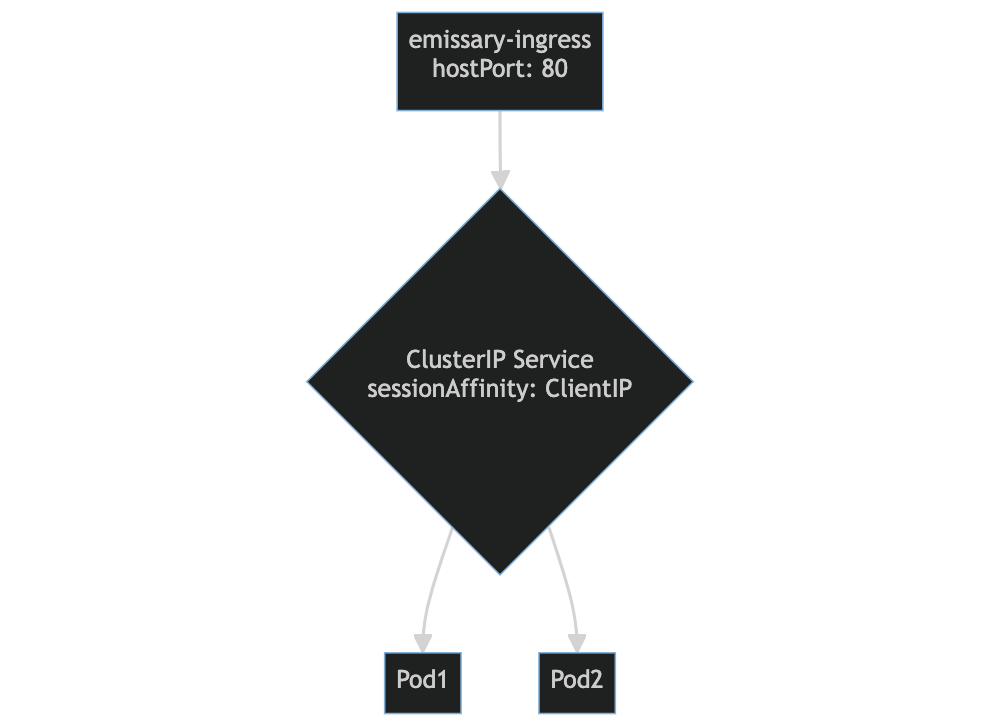

# emissary-ingress-example

Steps:

1. `kubectl apply -f qoute-deployment.yaml`
2. `kubectl apply -f qoute-service.yaml`
3. `helm repo add emissary-ingress https://app.getambassador.io`
4. `helm repo update`
5. `helm install emissary-ingress emissary-ingress/emissary-ingress`
6. `kubectl apply -f listener.yaml`
7. `kubectl apply -f resolver.yaml`
8. `kubectl apply -f mapping.yaml`

`curl http://<NODE_IP>`

